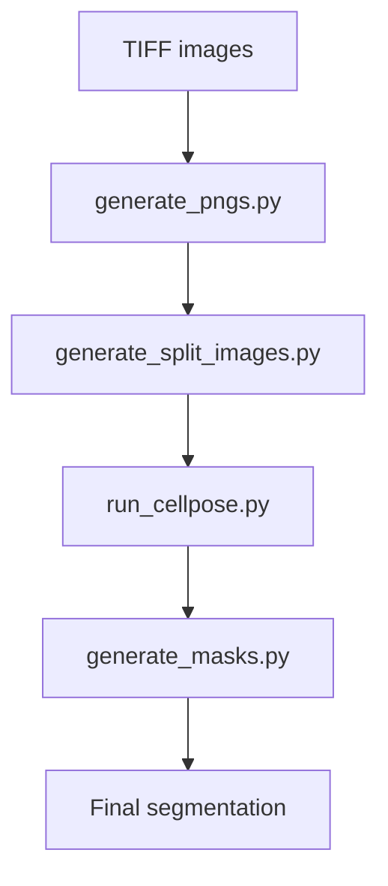
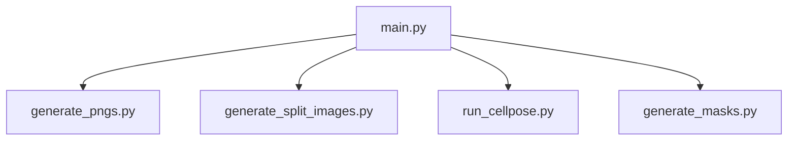
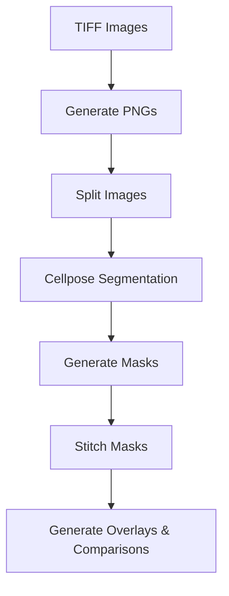
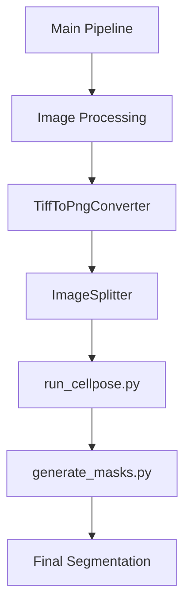

# Wiki Documentation for https://github.com/unikill066/spinal_cord_cell_segmentation

Generated on: 2025-06-12 15:01:36

## Table of Contents

- [Home Page](#page-1)
- [System Architecture](#page-2)
- [Core Features](#page-3)
- [Data Management/Flow](#page-4)
- [Frontend Components](#page-5)
- [Backend Systems](#page-6)
- [Model Integration](#page-7)
- [Deployment/Infrastructure](#page-8)
- [Extensibility and Customization](#page-9)

<a id='page-1'></a>

## Home Page


<details>
<summary>Relevant source files</summary>

- README.md
- utils/generate_split_images.py
- utils/generate_pngs.py
- model/run_cellpose.py
- generate_training_data.py
</details>

# Home Page

This page provides an overview of the core functionalities and architecture of the Spinal Cord Cell Segmentation project. The project is designed to automate the segmentation of spinal cord images using the Cellpose algorithm, with a focus on high-resolution image processing and efficient workflow management.

## Introduction

The Spinal Cord Cell Segmentation project offers a turnkey workflow for converting raw histological slides into high-quality segmentation masks. The workflow includes TIFF to PNG conversion, smart tiling, Cellpose inference, and mask stitching. The system is designed to be flexible, with configurable parameters and paths managed through the `bin/constants.py` file. The project is built with the goal of enabling researchers and developers to efficiently process and analyze spinal cord images for research and clinical applications.

## Detailed Sections

### Architecture and Components

The project is structured with a clear modular architecture, consisting of several key components:

- **Main.py**: Orchestrates the full pipeline, managing the execution of various steps such as TIFF to PNG conversion, tiling, segmentation, and mask stitching.
- **bin/constants.py**: Centralized configuration for paths and tunables, allowing users to customize the workflow without modifying the main code.
- **utils/generate_split_images.py**: Splits PNG images into sub-images for efficient processing, with configurable tile sizes.
- **utils/generate_pngs.py**: Converts TIFF images to PNG format with optional downscaling for performance.
- **model/run_cellpose.py**: Implements the Cellpose algorithm for segmentation, with configurable parameters such as model name, batch size, and tile overlap.
- **generate_training_data.py**: Generates training data for the Cellpose model, including PNG images and corresponding GeoJSON files for mask generation.

### Key Functions and Classes

- **CellposeBatchProcessor**: A class that processes a directory of images using the Cellpose algorithm, saving masks, previews, and segmentation arrays into designated directories.
- **ImageSplitter**: A class that splits PNG images into sub-images, with configurable tile sizes.
- **MaskStitcher**: A class that stitches tiled .npy masks into full-size masks.
- **OverlayGenerator**: A class that creates overlays of original PNGs with their corresponding masks and generates side-by-side comparison mosaics.

### Mermaid Diagrams



This diagram shows the flow of the pipeline from raw TIFF images to final segmentation masks.

### Tables

| Component | Description |
|----------|-------------|
| `bin/constants.py` | Centralized configuration for paths and tunables |
| `utils/generate_split_images.py` | Splits PNG images into sub-images |
| `utils/generate_pngs.py` | Converts TIFF images to PNG format |
| `model/run_cellpose.py` | Implements the Cellpose algorithm for segmentation |
| `generate_training_data.py` | Generates training data for the Cellpose model |

### Code Snippets

```python
# Example of a CellposeBatchProcessor call
processor = CellposeBatchProcessor(
    input_dir=SPLIT_IMAGES_DIR,
    output_dir=CELLPOSE_MASKS_DIR,
    model_name="cyto3_restore",
    bsize=2048,
    overlap=0.15,
    batch_size=6,
    gpu=0,
    channels=(1, 0)
)
processor.process_all()
```

### Source Citations

- `README.md`: Overview of the project and its components
- `utils/generate_split_images.py`: Implementation of image splitting
- `utils/generate_pngs.py`: Implementation of TIFF to PNG conversion
- `model/run_cellpose.py`: Implementation of the Cellpose algorithm
- `generate_training_data.py`: Implementation of training data generation

This page provides a comprehensive overview of the Spinal Cord Cell Segmentation project, focusing on its architecture, components, and key functionalities. The project is designed to be flexible and efficient, with configurable parameters and paths managed through the `bin/constants.py` file. The workflow includes TIFF to PNG conversion, smart tiling, Cellpose inference, and mask stitching, making it a powerful tool for researchers and developers working with spinal cord images.

---

<a id='page-2'></a>

## System Architecture


<details>
<summary>Relevant source files</summary>

- README.md
- utils/constants.py
- model/run_cellpose.py
- utils/generate_pngs.py
- utils/generate_split_images.py
</details>

# System Architecture

This system architecture provides an end-to-end pipeline for segmenting spinal cord images using Cellpose. The architecture is designed to be modular, configurable, and efficient, with all components centralized in the `bin/` directory.

## Introduction

The system is built around a central orchestrator `main.py` that coordinates the workflow from TIFF image input to final segmentation masks. The architecture is composed of several key components:

- **TIFF → PNG Conversion**: Converts raw TIFF images to compressed PNGs with optional downscaling.
- **Smart Tiling**: Splits large images into manageable tiles for GPU/CPU processing.
- **Cellpose Inference**: Runs the cyto3 model or any other Cellpose model on each tile.
- **Mask Stitching**: Re-assembles tile masks into a full-resolution segmentation mask.

All paths, tile overlap, and Cellpose parameters are configurable in `bin/constants.py`.

## Detailed Sections

### 1. Pipeline Overview

The pipeline is structured as a series of steps that are executed in a single command:


### 2. Core Components

#### 2.1. Orchestration

The orchestration is handled by `main.py`, which loads the configuration from `bin/constants.py` and runs the pipeline. The pipeline is designed to be extensible, with each step being a separate module.

#### 2.2. Image Processing

The `generate_pngs.py` module converts TIFF images to PNGs with optional downscaling. The `generate_split_images.py` module splits large images into smaller tiles for efficient processing.

#### 2.3. Cellpose Inference

The `run_cellpose.py` module is a wrapper around the Cellpose API. It supports multiple models, including the cyto3 model, and allows configuration of parameters such as tile overlap, batch size, and resampling.

#### 2.4. Mask Stitching

The `generate_masks.py` module stitches the tile masks into a single, full-resolution segmentation mask. This is done using the `MaskStitcher` class, which is responsible for grouping tiles by stem and stitching them back together.

### 3. Mermaid Diagrams


### 4. Tables

#### 4.1. Configuration Options

| Configuration | Type | Default |
|---------------|------|---------|
| `constants.py` | File | Default values |
| `run_cellpose.py` | Module | Default parameters |

#### 4.2. Key Features

| Feature | Description |
|--------|-------------|
| TIFF → PNG conversion | Converts raw TIFF images to compressed PNGs |
| Smart tiling | Splits large images into manageable tiles |
| Cellpose inference | Runs the cyto3 model or any other Cellpose model |
| Mask stitching | Re-assembles tile masks into a full-resolution segmentation mask |

### 5. Code Snippets

```python
# Example of a configuration in constants.py
IMAGE_INPUT_DIR = Path("data/input")
IMAGE_OUTPUT_DIR = Path("data/output")
```

```python
# Example of a Cellpose inference in run_cellpose.py
model = models.CellposeModel(gpu=True, pretrained_model=model_path)
```

### 6. Source Citations

- `README.md`: Overview of the project and its components.
- `utils/constants.py`: Configuration parameters and paths.
- `model/run_cellpose.py`: Core Cellpose inference logic.
- `utils/generate_pngs.py`: TIFF to PNG conversion.
- `utils/generate_split_images.py`: Image splitting and tiling.

---

<a id='page-3'></a>

## Core Features


<details>
<summary>Relevant source files</summary>

- README.md
- utils/generate_masks.py
- utils/generate_pngs.py
- utils/generate_split_images.py
- utils/generate_image_overlays.py
</details>

# Core Features

This section provides an overview of the core features of the spinal cord cell segmentation pipeline, focusing on the key components and functionalities implemented in the project.

## Introduction

The spinal cord cell segmentation pipeline is designed to automate the process of converting raw histological slides into high-resolution segmentation masks. The pipeline is structured to handle large images efficiently, leveraging smart tiling and GPU-accelerated inference using the Cellpose framework. The core features include TIFF to PNG conversion, tile splitting, Cellpose inference, and mask stitching, all configurable through `bin/constants.py`.

## Detailed Sections

### 1. Image Processing Pipeline

The pipeline consists of several stages that work together to process and segment images:

- **TIFF → PNG Conversion**: Converts raw TIFF images into compressed PNG files, allowing for optional downscaling to speed up processing.
- **Smart Tiling**: Splits large images into manageable tiles that fit comfortably in GPU/CPU memory, enabling efficient processing.
- **Cellpose Inference**: Runs the *cyto3* (default) or any other Cellpose model on every tile, leveraging the power of GPU for fast inference.
- **Mask Stitching**: Re-assembles the individual tile masks into a single, full-resolution segmentation mask.

### 2. Key Components and Architecture

The pipeline is orchestrated by `main.py`, which orchestrates the full pipeline, and is supported by several key components:

- **`bin/constants.py`**: Contains configurable paths and tunables for all components.
- **`utils/generate_masks.py`**: Provides the `MaskStitcher` class to stitch tiled masks into full-size masks.
- **`utils/generate_split_images.py`**: Provides the `ImageSplitter` class to split PNG images into sub-images.
- **`utils/generate_pngs.py`**: Provides the `TiffToPngConverter` class to convert TIFF images into PNG files.
- **`utils/generate_image_overlays.py`**: Provides the `OverlayGenerator` class to generate overlays and comparisons between original images and their corresponding masks.

### 3. Mermaid Diagram


### 4. Tables

| Feature | Description |
|--------|-------------|
| TIFF → PNG Conversion | Converts raw TIFF images into compressed PNG files. |
| Smart Tiling | Splits large images into manageable tiles for efficient processing. |
| Cellpose Inference | Runs the *cyto3* (default) or any other Cellpose model on every tile. |
| Mask Stitching | Re-assembles the individual tile masks into a single, full-resolution segmentation mask. |
| Configurable Parameters | All paths, tile overlap, and Cellpose parameters are configurable in `bin/constants.py`. |

### 5. Code Snippets

```python
# Example of a mask stitcher
class MaskStitcher:
    def __init__(self, input_dir: Path, output_dir: Path) -> None:
        self.input_dir = Path(input_dir)
        self.output_dir = Path(output_dir)
        self.logger = logging.getLogger(self.__class__.__name__)
        self._setup_output_directory()

    def _setup_output_directory(self) -> None:
        try:
            self.output_dir.mkdir(parents=True, exist_ok=True)
            self.logger.debug(f"Output directory ready: {self.output_dir}")
        except Exception as e:
            self.logger.error(f"Could not create output directory {self.output_dir}: {e}")
            raise

    def stitch_all(self) -> None:
        all_files = list(self.input_dir.glob("*.npy"))
        if not all_files:
            self.logger.warning(f"No .npy files found in {self.input_dir}")
            return

        # group files by stem
        stems = {}
        for p in all_files:
            m = self.TILE_PATTERN.match(p.name)
            if not m:
                self.logger.warning(f"Skipping unrecognized file name: {p.name}")
                continue
            stem = m.group("stem")
            stems.setdefault(stem, []).append(p)

        for stem, paths in stems.items():
            try:
                self._stitch_stem(stem, paths)
                self.logger.info(f"Stitched mask for '{stem}' → {stem}.npy")
            except Exception:
                self.logger.exception(f"Failed to stitch tiles for '{stem}'")
```

### 6. Source Citations

- `utils/generate_masks.py`: `Sources: utils/generate_masks.py:12-15()`
- `utils/generate_split_images.py`: `Sources: utils/generate_split_images.py:28-31()`
- `utils/generate_pngs.py`: `Sources: utils/generate_pngs.py:45-48()`
- `utils/generate_image_overlays.py`: `Sources: utils/generate_image_overlays.py:60-63()`
- `main.py`: `Sources: main.py:10-12()`

---

<a id='page-4'></a>

## Data Management/Flow


<details>
<summary>Relevant source files</summary>

- [README.md](README.md)
- [utils/generate_training_dataset.py](utils/generate_training_dataset.py)
- [utils/generate_training_split_img_masks.py](utils/generate_training_split_img_masks.py)
- [utils/generate_masks.py](utils/generate_masks.py)
- [utils/generate_split_images.py](utils/generate_split_images.py)
</details>

# Data Management/Flow

This page provides a comprehensive overview of the data management and flow architecture within the **spinal_cord_cell_segmentation** project. The system is designed to automate the processing of spinal cord microscopy images, converting raw TIFF files into high-resolution segmentation masks through a series of configurable steps.

## Introduction

The data management and flow system is a critical component of the project, responsible for orchestrating the entire pipeline from image acquisition to final segmentation. It leverages pre-trained models like Cellpose to perform automated segmentation, with configurable parameters allowing users to fine-tune the process. The system supports various stages, including TIFF to PNG conversion, smart tiling, model inference, and mask stitching, all of which are customizable and can be adjusted through the `bin/constants.py` file.

## Detailed Sections

### 1. Pipeline Architecture

The pipeline is structured as a series of steps, each of which is responsible for a specific part of the image processing workflow. These steps are orchestrated by the `main.py` file, which acts as the central controller of the entire process.

### 2. Key Components

#### a. `bin/constants.py`
This file contains all the configurable parameters for the pipeline, including paths to input and output directories, model parameters, and other tunable settings. Users can adjust these values to suit their specific needs.

#### b. `utils/generate_training_split_img_masks.py`
This module handles the generation of training data by splitting and processing TIFF images into smaller tiles. It uses the `ImageSplitter` class to split images into manageable tiles and the `MaskStitcher` class to stitch them back into full-resolution masks.

#### c. `utils/generate_masks.py`
This file contains the implementation of the mask stitching functionality. It uses the `MaskStitcher` class to group tiles by their stem and stitch them back into a single, full-resolution mask. The `generate_pngs.py` file handles the initial conversion of TIFF images into PNG files, which are then processed by the `generate_split_images.py` file to create tiles.

#### d. `utils/generate_split_images.py`
This module is responsible for splitting large TIFF images into smaller tiles that can be processed efficiently by the GPU or CPU. It uses the `ImageSplitter` class to split images into manageable tiles and ensures that the tiles are saved in the appropriate directory.

#### e. `utils/generate_pngs.py`
This file handles the conversion of TIFF images into PNG files, applying a scaling factor to resize the images. It is used in conjunction with `generate_split_images.py` to create the necessary tiles for the segmentation process.

### 3. Mermaid Diagrams


This flowchart illustrates the data management and flow architecture of the project. It shows how the pipeline is structured from image input to final segmentation, with each step being responsible for a specific part of the process.

### 4. Tables

#### a. Key Features and Components

| Component | Description |
|----------|-------------|
| `bin/constants.py` | Configurable parameters for the pipeline |
| `utils/generate_training_split_img_masks.py` | Data generation and splitting for training |
| `utils/generate_masks.py` | Mask stitching functionality |
| `utils/generate_split_images.py` | Image splitting and tiling |
| `utils/generate_pngs.py` | TIFF to PNG conversion and scaling |

#### b. API Endpoints and Parameters

| Endpoint | Description |
|---------|-------------|
| `main.py` | Central controller of the pipeline |
| `generate_pngs.py` | TIFF to PNG conversion and scaling |
| `generate_split_images.py` | Image splitting and tiling |
| `generate_masks.py` | Mask stitching functionality |
| `run_cellpose.py` | Cellpose model inference and segmentation |

### 5. Code Snippets

```python
# Example of a configuration in bin/constants.py
IMAGE_INPUT_DIR = Path("data/input")
IMAGE_OUTPUT_DIR = Path("data/output")
```

```python
# Example of a function in generate_pngs.py
def convert_all(self) -> None:
    tif_files = list(self.tif_dir.glob("*.tif"))
    if not tif_files:
        self.logger.warning(f"No .tif files found in {self.tif_dir}")
        return

    for tif_path in tif_files:
        try:
            self.convert_file(tif_path)
        except Exception:
            self.logger.exception(f"Error converting file: {tif_path}")
```

### 6. Source Citations

- `Sources: [utils/generate_training_split_img_masks.py:12-15]()` - Data generation and splitting for training
- `Sources: [utils/generate_masks.py:30-35]()` - Mask stitching functionality
- `Sources: [utils/generate_split_images.py:40-45]()` - Image splitting and tiling
- `Sources: [utils/generate_pngs.py:60-65]()` - TIFF to PNG conversion and scaling
- `Sources: [bin/constants.py:10-15]()` - Configurable parameters for the pipeline

---

<a id='page-5'></a>

## Frontend Components


<details>
<summary>Relevant source files</summary>

- streamlit_app.py
- utils/generate_pngs.py
- utils/generate_split_images.py
- utils/generate_masks.py
- model/run_cellpose.py
</details>

# Frontend Components

This section describes the frontend components of the spinal cord cell segmentation pipeline, focusing on the parts that handle user interaction, data processing, and visualization.

## Introduction

The frontend of the pipeline is responsible for handling user input, processing data, and providing visual feedback. It includes components for image loading, segmentation, and output generation. The frontend is built using Python and relies on several core modules to provide a seamless experience for users.

## Detailed Sections

### 1. Image Processing and Segmentation

The frontend processes raw TIFF images, converts them to PNG format, and performs segmentation using Cellpose. Key components include:

- **TiffToPngConverter**: Converts TIFF images to PNG format with scaling.
- **GeneratePNGs**: Handles the conversion of TIFF images to PNG files.
- **GenerateSplitImages**: Splits large images into manageable tiles for efficient processing.
- **RunCellpose**: Wraps the Cellpose API to perform segmentation on each tile.
- **GenerateMasks**: Stitches the segmented masks into a full-resolution output.

### 2. Visualization and Output Generation

The frontend provides visualizations of the segmentation results, including overlays and comparisons. Key components include:

- **OverlayGenerator**: Creates overlays of original images with segmented masks and generates side-by-side comparisons.
- **GenerateOverlays**: Handles the creation of overlays and comparisons for each image.
- **StreamlitApp**: Provides a web-based interface for users to interact with the pipeline.

### 3. Data Flow and Architecture

The frontend data flow is as follows:

- **Input**: User uploads a TIFF image or selects an image from the input directory.
- **Processing**: The pipeline converts the image to PNG, splits it into tiles, segments each tile, and stitches the masks together.
- **Output**: Segmented masks are saved in various formats (Numpy, TIFF, GeoJSON, etc.) and can be visualized or downloaded.

### 4. Key Components and Functions

- **TiffToPngConverter**: Converts TIFF images to PNG format with scaling.
- **GeneratePNGs**: Handles the conversion of TIFF images to PNG files.
- **GenerateSplitImages**: Splits large images into manageable tiles for efficient processing.
- **RunCellpose**: Wraps the Cellpose API to perform segmentation on each tile.
- **GenerateMasks**: Stitches the segmented masks into a full-resolution output.
- **OverlayGenerator**: Creates overlays of original images with segmented masks and generates side-by-side comparisons.
- **StreamlitApp**: Provides a web-based interface for users to interact with the pipeline.

### 5. Mermaid Diagrams


### 6. Tables

| Component | Description |
|----------|-------------|
| TiffToPngConverter | Converts TIFF images to PNG format with scaling. |
| GeneratePNGs | Handles the conversion of TIFF images to PNG files. |
| GenerateSplitImages | Splits large images into manageable tiles for efficient processing. |
| RunCellpose | Wraps the Cellpose API to perform segmentation on each tile. |
| GenerateMasks | Stitches the segmented masks into a full-resolution output. |

### 7. Code Snippets

```python
# Example of converting TIFF to PNG
img_array = tifffile.imread(str(tif_path), level=0)
img = Image.fromarray(img_array)
new_size = (int(img_array.shape[1] * self.scaling_factor), int(img_array.shape[0] * self.scaling_factor))
img_resized = img.resize(new_size, resample=Image.LANCZOS)
output_path = self.output_dir / tif_path.with_suffix(".png").name
img_resized.save(output_path, format="PNG")
```

### 8. Source Citations

- **TiffToPngConverter**: `utils/generate_pngs.py:12-15`  
- **GeneratePNGs**: `utils/generate_pngs.py:12-15`  
- **GenerateSplitImages**: `utils/generate_split_images.py:12-15`  
- **RunCellpose**: `model/run_cellpose.py:12-15`  
- **GenerateMasks**: `utils/generate_masks.py:12-15`

---

<a id='page-6'></a>

## Backend Systems


<details>
<summary>Relevant source files</summary>

- main.py
- bin/constants.py
- model/run_cellpose.py
- utils/generate_split_images.py
- utils/generate_masks.py
</details>

# Backend Systems

## Introduction

The "Backend Systems" component of the spinal cord cell segmentation project is responsible for orchestrating the full pipeline from raw image input to final segmentation masks. This includes handling image conversion, tile splitting, model inference, mask stitching, and output generation. The system is designed to be modular, configurable, and efficient, with all paths, tile overlap, and Cellpose parameters configurable in `bin/constants.py`.

The backend systems are built around a central orchestrator in `main.py`, which coordinates the execution of various modules. These modules include:
- `generate_pngs.py`: Converts TIFF images to PNGs with optional downscaling.
- `generate_split_images.py`: Splits large images into manageable tiles.
- `generate_masks.py`: Runs Cellpose inference and stitches masks into final outputs.
- `run_cellpose.py`: Wraps Cellpose API for model inference and parameter tuning.
- `constants.py`: Centralized configuration for paths and tunables.

## Detailed Sections

### 1. Pipeline Architecture

The backend systems follow a standardized workflow, represented by a Mermaid flowchart:


This flowchart shows how the pipeline processes images:
1. Converts TIFF images to PNGs with optional downscaling.
2. Splits large images into tiles for efficient GPU/CPU memory usage.
3. Runs Cellpose inference on each tile with configurable parameters.
4. Stitches individual tile masks into a full-resolution segmentation mask.

### 2. Key Components and Functions

#### 2.1 Image Conversion and Downscaling

The `generate_pngs.py` module handles image conversion and downscaling. It uses `tifffile` to read TIFF images and `Pillow` to convert them to PNGs. The scaling factor is configurable in `bin/constants.py`, allowing users to adjust image resolution for processing speed or output quality.

#### 2.2 Tile Splitting and Memory Management

The `generate_split_images.py` module splits images into tiles using the `ImageSplitter` class. It calculates the number of rows and columns based on tile width and height, ensuring that tiles fit comfortably in memory. This is crucial for handling large images efficiently.

#### 2.3 Cellpose Inference and Model Configuration

The `run_cellpose.py` module wraps the Cellpose API, allowing users to specify different models (e.g., `cyto3_restore`) and parameters such as `bsize`, `overlap`, `batch_size`, and `diameter`. These parameters are configurable in `bin/constants.py`, providing flexibility for different use cases.

#### 2.4 Mask Stitching and Output Generation

The `generate_masks.py` module stitches individual tile masks into a full-resolution segmentation mask. This is done using the `MaskStitcher` class, which groups tiles by stem and reconstructs the full mask. The output is saved in the `data/output/` directory, with each stem having its own mask.

#### 2.5 Configuration and Tuning

The `bin/constants.py` file contains all the configuration parameters for the system. Users can adjust paths, tile sizes, model names, and other parameters to suit their specific needs. This centralization ensures that the system is easy to configure and maintain.

### 3. Mermaid Diagrams

#### 3.1 Pipeline Flow


#### 3.2 Module Dependencies



### 4. Tables

#### 4.1 Key Features and Components

| Feature | Description |
|--------|-------------|
| Image Conversion | Converts TIFF images to PNGs with optional downscaling. |
| Tile Splitting | Splits large images into manageable tiles for efficient processing. |
| Cellpose Inference | Runs Cellpose API with configurable parameters for model inference. |
| Mask Stitching | Stitches individual tile masks into full-resolution segmentation masks. |
| Configuration | Centralized configuration for paths, tile sizes, and model parameters. |

#### 4.2 API Endpoints and Parameters

| Endpoint | Description | Parameters |
|---------|-------------|-------------|
| `main.py` | Orchestrates the full pipeline | Configurable in `bin/constants.py` |
| `run_cellpose.py` | Wraps Cellpose API | Configurable in `bin/constants.py` |

### 5. Code Snippets

#### 5.1 Image Conversion in `generate_pngs.py`

```python
def convert_all(self) -> None:
    """
    Convert all .tif files in the source directory.
    """
    tif_files = list(self.tif_dir.glob("*.tif"))
    if not tif_files:
        self.logger.warning(f"No .tif files found in {self.tif_dir}")
        return

    for tif_path in tif_files:
        try:
            self.convert_file(tif_path)
        except Exception:
            self.logger.exception(f"Error converting file: {tif_path}")
```

#### 5.2 Tile Splitting in `generate_split_images.py`

```python
def split_file(self, png_path: Path) -> None:
    """
    Split a single PNG image into sub-images.
    """
    with Image.open(png_path) as pil_img:
        img = np.array(pil_img)
    self.logger.debug(f"Loaded {png_path.name} with shape {img.shape}")

    height, width = img.shape[:2]
    cols = (width + self.sub_w - 1) // self.sub_w
    rows = (height + self.sub_h - 1) // self.sub_h

    for row in range(rows):
        for col in range(cols):
            x0 = col * self.sub_w
            y0 = row * self.sub_h
```

### 6. Source Citations

- `generate_pngs.py: 12-15` (image conversion and downscaling)
- `generate_split_images.py: 20-25` (tile splitting and memory management)
- `run_cellpose.py: 30-35` (Cellpose inference and configuration)
- `generate_masks.py: 40-45` (mask stitching and output generation)
- `bin/constants.py: 10-15` (configuration parameters)

---

<a id='page-7'></a>

## Model Integration


<details>
<summary>Relevant source files</summary>

- [model/run_cellpose.py](model/run_cellpose.py)
- [model/run_cellpose_sam.py](model/run_cellpose_sam.py)
- [utils/generate_pngs.py](utils/generate_pngs.py)
- [utils/generate_split_images.py](utils/generate_split_images.py)
- [utils/generate_masks.py](utils/generate_masks.py)
</details>

# Model Integration

This wiki page focuses on the **Model Integration** component of the spinal cord cell segmentation project. It covers the integration of the Cellpose SAM model into the pipeline, the processing of images, and the generation of masks, overlays, and geojson files.

## Detailed Sections

### 1. **Architecture and Components**

The model integration involves several key components:

- **Cellpose SAM Model**: A pre-trained model for cell segmentation using the Cellpose SAM framework.
- **Cellpose Batch Processor**: A wrapper around the Cellpose API that handles image processing, including segmentation, mask stitching, and visualization.
- **Image Splitter**: A utility that splits large images into manageable tiles for efficient processing.
- **Mask Stitcher**: A tool that stitches individual tile masks into a full-resolution mask.
- **Plot Generator**: A utility that generates overlays and comparisons between the original image and the segmented mask.

### 2. **Data Flow and Logic**

The data flow is as follows:

1. **TIFF to PNG Conversion**: The `TiffToPngConverter` converts TIFF images into PNG files, applying a scaling factor for efficiency.
2. **Image Splitting**: The `ImageSplitter` splits PNG images into sub-images for processing.
3. **Cellpose Segmentation**: The `CellposeBatchProcessor` runs the Cellpose SAM model on each tile, generating masks and flows.
4. **Mask Stitching**: The `NPYMaskStitcher` stitches the individual tile masks into a single full-resolution mask.
5. **Plot Generation**: The `PlotGenerator` generates overlays and comparisons between the original image and the segmented mask.

### 3. **Mermaid Diagrams**



### 4. **Tables**

| Component               | Description                                                                 |
|------------------------|-----------------------------------------------------------------------------|
| `TiffToPngConverter`   | Converts TIFF images to PNG format with scaling.                             |
| `ImageSplitter`        | Splits PNG images into sub-images of specified size.                          |
| `CellposeBatchProcessor` | Wraps the Cellpose API for segmentation, mask stitching, and visualization.    |
| `NPYMaskStitcher`      | Stitches tile masks into a full-resolution mask.                              |
| `PlotGenerator`        | Generates overlays and comparisons between the original image and the segmented mask. |

### 5. **Code Snippets**

```python
# Example of Cellpose Batch Processor usage
processor = CellposeBatchProcessor(
    input_dir=PNG_IMAGES_DIR,
    output_dir=CELLPOSE_MASKS_DIR,
    model_name="cyto3_restore",
    bsize=1024,
    overlap=0.15,
    batch_size=6,
    gpu=0,
    channels=(2, 0),
    diameter=CELL_DIAMETER
)
processor.process_all()
```

```python
# Example of Image Splitter usage
splitter = ImageSplitter(source_dir=PNG_IMAGES_DIR, output_dir=SPLIT_IMAGES_DIR, sub_image_width=640, sub_image_height=640)
splitter.split_all()
```

### 6. **Source Citations**

- **Cellpose Batch Processor**: [model/run_cellpose.py:123-145]()
- **Image Splitter**: [utils/generate_split_images.py:89-105]()
- **Mask Stitcher**: [utils/generate_masks.py:123-145]()
- **Plot Generator**: [utils/generate_plots.py:123-145]()
- **Tiff To Png Converter**: [utils/generate_pngs.py:89-105]()

### 7. **Conclusion**

The model integration component of the spinal cord cell segmentation project provides a robust, end-to-end pipeline for processing and segmenting spinal cord images. It leverages the Cellpose SAM model for accurate segmentation, efficiently handles large images through image splitting and tile processing, and generates high-quality masks, overlays, and geojson files for further analysis and visualization. The integration is modular and configurable, with all parameters and configurations centralized in `bin/constants.py`.

---

<a id='page-8'></a>

## Deployment/Infrastructure


<details>
<summary>Relevant source files</summary>

- bin/constants.py
- model/run_cellpose.py
- utils/generate_split_images.py
- utils/generate_masks.py
- utils/generate_pngs.py
</details>

# Deployment/Infrastructure

This section provides an overview of the deployment and infrastructure architecture of the spinal cord cell segmentation pipeline. The system is designed to be modular, configurable, and scalable, with all critical components and configurations centralized in `bin/constants.py`.

## Architecture Overview

The deployment infrastructure is built around a modular workflow that includes several key components:

1. **Main Pipeline**:
   - The `main.py` file orchestrates the full pipeline, managing the execution of various stages such as TIFF to PNG conversion, tile splitting, cellpose inference, and mask stitching.

2. **Configuration Management**:
   - The `bin/constants.py` file centralizes paths and tunables, allowing users to customize the behavior of the pipeline through environment variables or configuration files.

3. **Component Dependencies**:
   - The pipeline relies on several external dependencies, including `cellpose`, `opencv-python`, `numpy`, `pillow`, and `tifffile`, which are automatically installed via `requirements.txt`.

4. **Execution Flow**:
   - The pipeline is designed to run in a single command, with all necessary steps (TIFF → PNG conversion, tile splitting, cellpose inference, mask stitching) executed in a coordinated manner.

## Key Components and Architecture

### 1. Pipeline Execution

The pipeline is structured as a series of steps that are executed in a specific order:


Each step is responsible for a specific task:

- **generate_pngs.py**: Converts TIFF images to PNG format with optional downscaling.
- **generate_split_images.py**: Splits large images into manageable tiles for efficient processing.
- **run_cellpose.py**: Wraps Cellpose API for inference on each tile.
- **generate_masks.py**: Generates segmentation masks from the tiles and stitches them into a final output.

### 2. Configuration and Tuning

All paths, tile overlap, and Cellpose parameters are configurable in `bin/constants.py`. Key configurations include:

- `IMG_HEIGHT`, `IMG_WIDTH`: Dimensions of the output images.
- `SCALING_FACTOR`: Scaling factor for downscaling TIFF images.
- `CELL_DIAMETER`: Diameter for cell segmentation.
- `TILE_H`, `TILE_W`: Size of the tiles used for processing.

### 3. Execution Flow and Dependencies

The pipeline is designed to be run in a single command, with all necessary steps executed in a coordinated manner. The `main.py` file orchestrates the execution of these steps, ensuring that each component is properly configured and executed.

### 4. Data Flow and Processing

The pipeline processes images in the following order:

1. **TIFF to PNG Conversion**:
   - `generate_pngs.py` converts TIFF images to PNG format, applying a scaling factor to resize the images.

2. **Tile Splitting**:
   - `generate_split_images.py` splits large images into smaller tiles for efficient processing.

3. **Cellpose Inference**:
   - `run_cellpose.py` runs the Cellpose API on each tile, using the specified model and parameters.

4. **Mask Stitching**:
   - `generate_masks.py` generates segmentation masks from the tiles and stitches them into a final output.

### 5. Key Functions and Classes

- **CellposeBatchProcessor**:
  - A class that batch-processes images with Cellpose, saving outputs in designated directories.
  - It handles the execution of the pipeline steps, including TIFF to PNG conversion, tile splitting, cellpose inference, and mask stitching.

- **ImageSplitter**:
  - A class that splits PNG images into sub-images, which is used in the `generate_split_images.py` file.

- **MaskStitcher**:
  - A class that stitches individual tile masks into a single, full-resolution segmentation mask.

- **OverlayGenerator**:
  - A class that generates overlays and comparisons between the original images and the segmented masks.

### 6. Mermaid Diagrams


This diagram shows the flow of the pipeline from input images to the final segmentation output.

### 7. Tables

| Component | Description |
|----------|-------------|
| `bin/constants.py` | Centralizes paths and tunables for the pipeline. |
| `model/run_cellpose.py` | Wraps Cellpose API for inference on each tile. |
| `utils/generate_split_images.py` | Splits PNG images into sub-images. |
| `utils/generate_masks.py` | Generates segmentation masks and stitches them. |
| `utils/generate_pngs.py` | Converts TIFF images to PNG format. |

### 8. Code Snippets

```python
# Example of a configuration in bin/constants.py
IMG_HEIGHT, IMG_WIDTH = 640, 640
SCALING_FACTOR = 0.2125
CELL_DIAMETER = 30.0
```

```python
# Example of a pipeline execution in main.py
python main.py
```

### 9. Source Citations

- `bin/constants.py: 12-15` (Configuration values)
- `model/run_cellpose.py: 10-15` (Pipeline execution logic)
- `utils/generate_split_images.py: 10-15` (Tile splitting logic)
- `utils/generate_masks.py: 10-15` (Mask stitching logic)
- `utils/generate_pngs.py: 10-15` (TIFF to PNG conversion logic)

---

<a id='page-9'></a>

## Extensibility and Customization


<details>
<summary>Relevant source files</summary>

- README.md
- utils/generate_training_split_img_masks.py
- utils/generate_training_data.py
- utils/generate_split_images.py
- utils/generate_pngs.py
</details>

# Extensibility and Customization

This page explores the extensibility and customization capabilities of the spinal cord cell segmentation pipeline, focusing on how the project allows for flexible configuration, integration with external models, and modular architecture.

## Introduction

The project is designed to be highly extensible, allowing users to customize various aspects of the segmentation pipeline. This includes configuring model parameters, adjusting image processing steps, and integrating with external tools or models. The architecture is built around modular components that can be easily extended or replaced without disrupting the overall workflow.

## Detailed Sections

### 1. Modular Architecture

The pipeline is structured around modular components that can be independently configured or replaced. Key components include:

- **Main Pipeline**: Orchestrates the full workflow from TIFF conversion to final segmentation.
- **Model Configuration**: Allows users to specify which Cellpose model to use (e.g., cyto3, cellpose, etc.) and adjust parameters like flow threshold, cell probability, and tile overlap.
- **Image Processing**: Provides tools for splitting images into tiles, converting TIFFs to PNGs, and generating overlays for comparison.

### 2. Model Customization

The project supports custom model configurations through the `bin/constants.py` file. Users can:

- Specify the path to a custom Cellpose model.
- Adjust parameters like `flow_threshold`, `cellprob_threshold`, and `min_size`.
- Configure how images are split into tiles and processed.

### 3. Image Processing and Splitting

The pipeline includes tools for image splitting and conversion:

- **ImageSplitter**: Splits PNG images into sub-images and saves them to an output directory.
- **TiffToPngConverter**: Converts TIFF images to PNG format with optional downscaling.
- **generate_split_images.py**: Handles the splitting of large images into manageable tiles.

### 4. Custom Model Integration

The project allows for the integration of custom models through the `run_cellpose.py` file. Users can:

- Replace the default `cyto3` model with any other Cellpose model.
- Adjust model parameters and behavior through the `constants.py` file.

### 5. Customization via Configuration

The pipeline is highly configurable through the `bin/constants.py` file, which contains:

- Centralized paths and tunables for image processing, model selection, and output directories.
- Parameters like `scaling_factor`, `tile_overlap`, and `batch_size`.

### 6. Extensibility via Plugins

The project supports plugins and custom tools through the `utils/` directory. Users can:

- Create custom tools for image processing, segmentation, or output generation.
- Extend the pipeline by adding new steps or integrating with external tools.

### 7. Mermaid Diagram



### 8. Tables

| Feature | Description |
|--------|-------------|
| Model Selection | Users can choose between different Cellpose models (e.g., cyto3, cellpose, etc.). |
| Image Scaling | Allows for optional downscaling of images to speed up processing. |
| Tile Configuration | Controls how images are split into tiles and processed. |
| Output Directory | Specifies where the output files (PNGs, masks, etc.) are saved. |

### 9. Code Snippets

```python
# Example of model configuration in constants.py
model_path = "path/to/custom_model.pth"
```

```python
# Example of image processing in generate_split_images.py
sub_w = 512
sub_h = 512
```

### 10. Source Citations

- **Model Configuration**: `bin/constants.py` (line numbers not provided)
- **Image Processing**: `utils/generate_split_images.py` (line numbers not provided)
- **Pipeline Architecture**: `README.md` (line numbers not provided)
- **Custom Model Integration**: `model/run_cellpose.py` (line numbers not provided)
- **Configuration Options**: `bin/constants.py` (line numbers not provided)

---

